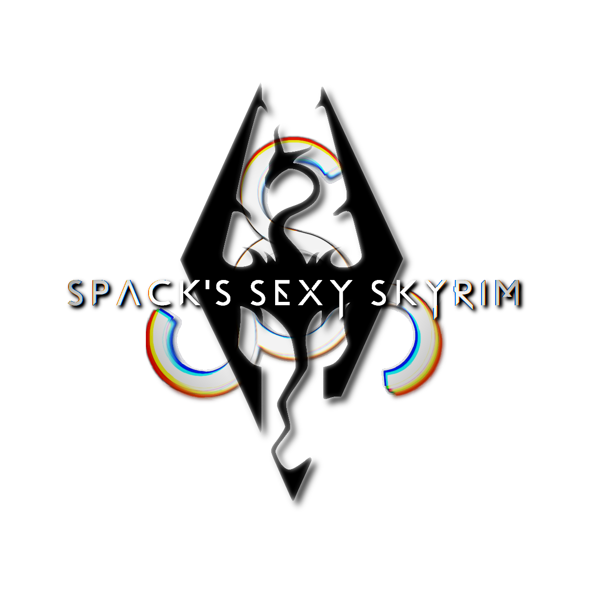
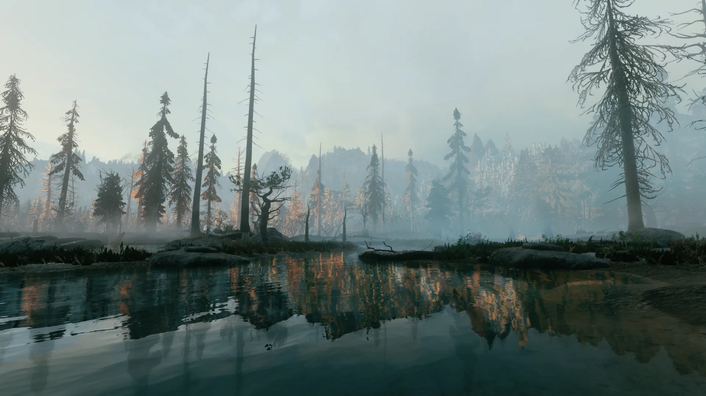

# SSS
A Skyrim Together Wabbajack modlist.

View the complete list of mods [here](https://loadorderlibrary.com/lists/spacks-sexy-skyrim)!

## Contents
  - [Preamble](#preamble)
  - [Requirements](#requirements)
    - [Accounts](#accounts)
    - [Disk Space](#disk-space)
  - [Installation](#installation)
    - [Pre-Installation](#pre-installation)
    - [Wabbajack Installation](#wabbajack-installation)
      - [Installing Wabbajack](#installing-wabbajack)
      - [Downloading and Installing SSS](#downloading-and-installing-SSS)
      - [Problems with Installation](#problems-with-installation)
  - [Post-Installation](#post-installation)
    - [Game Folder](#game-folder)
  - [Playing the Modist](#playing-the-list)
    - [Starting Mod Organizer](#starting-mod-organizer)
    - [Starting the Game](#starting-the-game)
    - [Character Creation Info](#character-creation-info)
    - [Controls](#controls)
    - [Skyrim Together Info](#skyrim-together-info)
  - [Updating](#updating)
    <!--- [Updating Skyrim Together](#updating-skyrim-together)-->
    - [Updating the Modlist](#updating-the-modlist)
  - [FAQ & Common Issues](#faq--common-issues)
  - [Removing the Modlist](#removing-the-modlist)
  - [Credits and Thanks](#credits-and-thanks)

## Preamble
SSS (Spack's Sexy Skyrim) is the modlist ever. Using Animonculory Visual Overhaul as a base, SSS is primarily meant to provide a complete overhaul of Skyrim's graphics while also including:

- Improved and tweaked combat
- Actually playable third-person
- Redone and improved animations
- Expanded soundscape, sound FX, and music
- Redone and improved magic, perks, shouts, etc
- A ton of character creation options
- Many quality-of-life features and fixes
- And more!

All of this while being tested, patched, and tweaked specifically for maximum compatibility with Skyrim Together.

This modlist is great for those who want to just **play** modded Skyrim Together without the massive effort and time commitment of building your own list, patching, and testing for bugs and compatibility.

It's also great for those who are new to Skyrim or modded Skyrim because of the list's emphasis on mostly tweaking and improving upon the vanilla base, rather than creating a new game entirely and requiring a dictionary's worth of information to get started.

## :clap: READ :clap: THE :clap: INSTRUCTIONS :clap:

	Please read the installation guide in its entirety.
	Especially if you're new to Wabbajack or Skyrim modding in general.
	
	This is a step-by-step list of instructions.
	I made sure every one is as clear and concise as possible.
	
	If something doesn't work as expected, or you need clarification, check this page first.
	You will get your solution much quicker, and you won't waste other peoples' time. Win-win.

## Requirements
### Accounts
##### NexusMods
  - You will need a [NexusMods](https://users.nexusmods.com/register) account.
  - Nexus Premium (~$7) is highly recommended as well. Otherwise you will have to manually click the download button on each mod.

##### LoversLab
  - You will also need a [LoversLab](https://www.loverslab.com/register/) account.

### Disk Space
  - Space required: **approx. 180 GB** (including downloads)
  - I recommend having the downloads folder on an SSD, as it will drastically speed up the installation.

## Installation
If you are updating the modlist, skip to the [updating section](#updating-the-modlist).

### Pre-Installation
Prior to installing, complete the following steps. If you've already done this, you shouldn't need to do it again.

1. Install [Visual C++ x64](https://aka.ms/vs/16/release/vc_redist.x64.exe) & [.Net Runtime v5 desktop x64](https://dotnet.microsoft.com/en-us/download/dotnet/5.0/runtime).
2. **Fully uninstall Skyrim** by deleting the Skyrim Special Edition folder in Steam and the Skyrim Special Edition folder inside `Documents\My Games`.
3. Reinstall Skyrim **outside of a Windows system-managed folder. (e.g. Desktop, Downloads)**. Somewhere like `C:\Games` is a good location. I recommend using [this program](https://github.com/LostDragonist/steam-library-setup-tool/wiki/Usage-Guide) to easily set up a new Steam library location.
4. Change Skyrim so it does not [automatically update](https://help.steampowered.com/en/faqs/view/71AB-698D-57EB-178C#disable).
5. Start the game's launcher and let it do the graphics check. Do not worry about the settings as they will be replaced during installation.
6. Start the game. Once you've reached the main menu, you may exit and proceed with installation. You do not need to download any of the CC content for this modlist.

### Wabbajack Installation

#### Installing Wabbajack
Download the [latest version of Wabbajack](https://github.com/wabbajack-tools/wabbajack/releases) and place it in a folder such as `C:\Wabbajack`. **Do not install it into a Windows system-managed folder. (e.g. Desktop, Downloads)** I recommend placing it on an SSD as it will work quicker on there.

#### Downloading and Installing SSS
Downloading and installing the modlist can take a while depending on your internet speed and hardware. To install SSS, complete the following steps.

1. Grab the [latest version of the modlist](/../../releases/latest). You only need to download the .wabbajack file. 
2. Open the .wabbajack file. Wabbajack should open.
3. Set the Installation Location to be somewhere like `C:\SSS`. **Do not install it into a Windows system-managed folder. (e.g. Desktop, Downloads)**
4. Press the button to begin the install.
	- If you have Nexus Premium, feel free to go do something else while WJ does its thing.
	- If not, you will have to start the download for each mod manually.
6. If the installation is successful, move on to [Post-Installation](#post-installation).

##### Problems with Installation
It is possible that you may encounter an error with Wabbajack when installing. Some common issues are listed below.

- Could not download X file:
	- Big files can fail to download due to connection issues. You can either try running Wabbajack again or download the file manually and place it in the downloads folder.
	- If the problematic file is from MEGA or LoversLab, I would recommend downloading it manually. Open the latest Wabbajack log and locate the file's URL at or near the bottom of the log. Place the downloaded file in the modlist's downloads folder and restart Wabbajack. **DO NOT EXTRACT THE FILE**.

- Wabbajack could not find my game folder:
	- Either buy the game or re-read the [Pre-Installation](#pre-installation) step.

- Antivirus reports a virus:
	- Windows may automatically quarantine a key file which is needed for Mod Organizer. You can fix this by [adding an exclusion for Mod Organizer in windows defender](https://www.thewindowsclub.com/exclude-a-folder-from-windows-security-scan).

## Post-Installation

### Game Folder
SSS uses a Wabbajack feature called Stock Game to keep your original Skyrim installation clean. All the files that you need to run the list are in a folder called “Game Root”.

## Playing the List

### Starting Mod Organizer
Open the installation folder and double click on the program called `ModOrganizer.exe`. 

### Starting the Game
Make sure the dropdown box at the top-right is set to `Skyrim Together Reborn`. Press the `Run` button.

**If you are starting Skyrim Together for the first time**: when prompted, select `SkyrimSE.exe` **from the modlist's "Game Root" folder – NOT Steam's Skyrim Special Edition folder!**

SSS uses [Optional Quick Start](https://www.nexusmods.com/skyrimspecialedition/mods/63953). You are free to either play through the introduction or skip it.

### Character Creation Info
While [RaceMenu](https://www.nexusmods.com/skyrimspecialedition/mods/19080) is included to provide a vastly improved character creation UI, **many of its features are not compatible with Skyrim Together**. When creating your character, here are some simple ground rules to avoid desync and other, more serious issues. Yeah, I tested all of this so that you don't have to.

1. **Do not use custom RGB colors for any vanilla tintmask. You MUST use preset colors.**
	
	- This includes skin tone, hair color, vanilla makeup, etc; anything in the "Colors" tab. ***Custom colors will cause synchronization issues 100% of the time.***
	
2. **Anything in the "Makeup" tab will sync, and can be a custom RGB color.**
	
	- Feel free to go crazy here!

3. **Nothing in the "Body Paint", "Face Paint", "Hand Paint", or "Foot Paint" tabs will sync.**

	- You may still add paints here; just keep in mind that other players will not be able to see them.
	
4. **RaceMenu-added morphs will not sync.**
	
	- Like #3, these are also non-problematic, but if you want to make sure you look correct on every client, go to the "All" tab and make sure every slider below "Lip Color" is zeroed/default.

### Controls
There are many mod-added hotkeys and menus. The most important ones are listed below. Most of these may be rebound in the MCM.

- **Skyrim Together Menu**: `Right Control` or `F2` (cannot be rebound, afaik)
- **Emotes**: `Right Alt`
- **Lock-On**: `Middle Mouse Button`
- **Toggle UI**: `X`
- **ENB**:
	- **Screenshot**: `F1` (saved to the Game Root folder)
	- **FPS Counter**: `F5`
	- **Toggle DOF**: `F10`
	- **Options Menu**: `F11`
- **Hotkey Potions**:
	- **Health**: `<`
	- **Stamina**: `>`
	- **Magicka**: `/`
- **Simplest Horses Hotkey**: `H` ([modpage](https://www.nexusmods.com/skyrimspecialedition/mods/54225) for more information)
- **Immersive Equipment Displays Options**: `F4`

### Skyrim Together Info
For information on questing and Skyrim Together's party system, read the [Playguide](https://wiki.tiltedphoques.com/tilted-online/general-information/playguide).

**If you have any Skyrim Together related issues**:

- First read [this modlist's FAQ](#faq-&-common-issues).
- If your issue isn't resolved: check out Skyrim Together's [Troubleshooting](https://wiki.tiltedphoques.com/tilted-online/guides/troubleshooting) and [FAQ](https://wiki.tiltedphoques.com/tilted-online/general-information/faq) sections.
- If your issue still isn't resolved: **Report them to ME. DO NOT report bugs to or bother the Skyrim Together/Tilted Online devs!** They are not and should not be responsible for issues with this specific modlist. If your issue isn't listed on their site, assume I caused it myself.

Phew. That was a lot of information. You made it. ***Now go fist fight some dragons—together!***

## Updating
There are two important updates you should be aware of:
- Updates to Skyrim Together. I recommend always having the latest version.
- Updates to the modlist itself. These are not required, but may have vital fixes; check the [changelog](CHANGELOG.md) for update information.

<!--
### Updating Skyrim Together
If there is an update to ST, it's very easy to apply yourself and is much less time-consuming to update than installing the latest list.

#### Enabling MO2 Downloads
If you've already done this once, you can skip to the [next section](#downloading-and-updating-skyrim-together).

1. In MO2, press Ctrl+S or press the Settings button in the top left.

2. In the Settings window, go to the "Nexus" tab and click `Associate with "Download with manager" links`.

#### Downloading and Updating Skyrim Together
1. Go to the [Skyrim Together modpage](https://www.nexusmods.com/skyrimspecialedition/mods/69993?tab=files) and click the `Mod Manager Download` button under "Main Files".

2. The mod should now be downloading through MO2. You can find it under the "Downloads" tab in the right pane of MO2 by sorting by filetime. Once the download is finished, double click the file to install it.

3. A window will pop up. Press `OK`.

4. Another window will pop up. Press `Ignore`.

5. *Another* window will pop up. Press `Replace`.

6. You're done!
-->

### Updating the Modlist
**Notes**:
- Any mods you have added yourself will be deleted when updating. Add `[NoDelete]` to the front of the mod's filename to prevent Wabbajack from deleting it.
- Your saves will not be deleted, and unless explicitly stated, updates to the modlist should be save-compatible.

Updating is like re-installing the list. Simply download the new .wabbajack file and open it. Make sure your paths are the same and tick the `overwrite existing modlist` button. It'll just work.

## FAQ & Common Issues
#### I get an "Address Library" error when launching Skyrim Together!
- You didn't select the correct SkyrimSE executable. When launching Skyrim Together through MO2, hold down Space and select the correct .exe from `SSS\Game Root`.

#### How do I enable male dongers and female whizbangers?
- Enable nudity by expanding the `Nudity` separator in the left pane of MO2, and activating the mod. It is simply a mesh replacer and will not cause desync or save-related issues.

#### I don't like the included ENB!
- The list uses NAT's weather, so you can easily replace the included ENB with an preset that is made for its weathers, such as [NAT.ENB](https://www.nexusmods.com/skyrimspecialedition/mods/27141) or [Cabbage](https://drive.google.com/file/d/1zUtXwRXjvgRfO3R7xN-uqSoC17qS-Lxc/view).
- Several presets are already included, and ENB Organizer is included to help you manage and try out different presets. You may launch it either from `SSS\tools\ENB Organizer`, or through MO2. To switch presets, open the presets tab. First disable the active preset, then enable the desired one.
- I highly recommend Cabbage; so much so that I included some fixes and tweaks in ENB Organizer. Simply install Cabbage by navigating to `SSS\tools\ENB Organizer\Games\SkyrimSE\Presets` and copying JUST the "enbseries" folder from the Cabbage archive into "Spack's Cabbage" and/or "Spack's Cabbage - Performance". **Click skip when prompted – do not overwrite.**

#### My face gets fucked up after character creation!
- Quit to main menu and reload.

#### My face gets fucked up after seeing another player on a server!
- Save, quit to main menu, and reload. This *should* permanently fix it. This happens because of the way ST generates and caches facegen for other players.

#### Various character features (e.g. bodypaints, hair color) do not sync correctly!
- Read the above issue first. If this doesn't apply to you...
- Go back and read [the section where I thoroughly and painstakingly outlined what to avoid when creating your character.](#character-creation-info) Please, at least read the bolded shit.

#### When I start the game, it hangs on the loading screen!
- Once the game window opens, don't tab out until you get to the main menu. It doesn't like that, and I have no idea why.

#### X outfit has clipping issues!
- I know, and I care too, but this isn't my problem to fix. Feel free to let me know of issues with outfits OTHER THAN clipping. (vanilla textures, incorrect textures, etc)

#### The Skyrim Together UI will not show up!
- Just Skyrim Together things. Try quitting to main menu, and reloading. If that doesn't work, you will unfortunately have to restart the game. This may be fixed in a future Skyrim Together update. 

#### Save games show up as corrupt!
- Just Skyrim Together things. Restart the game and they should no longer be "corrupt". This may be fixed in a future Skyrim Together update.

## Removing the Modlist
Everything in the modlist is self-contained. Simply delete the modlist folder, and you have uninstalled it.

## Credits and Thanks
- _YOU_ for reading this. Thank you!
- Althro and the Animonculory Team for AVO, the foundation of this list. Let's be real here: they did 99% of the work for me.
- TitansBane and Sovn for their lists, Elysium and Aldrnari, respectively. Many of my decisions were inspired by their work and my many hours of gameplay in their modlists.
- My friends, for playtesting, giving feedback, and their emotional and moral support.
- The bear, for its unyielding dedication to my cause.

