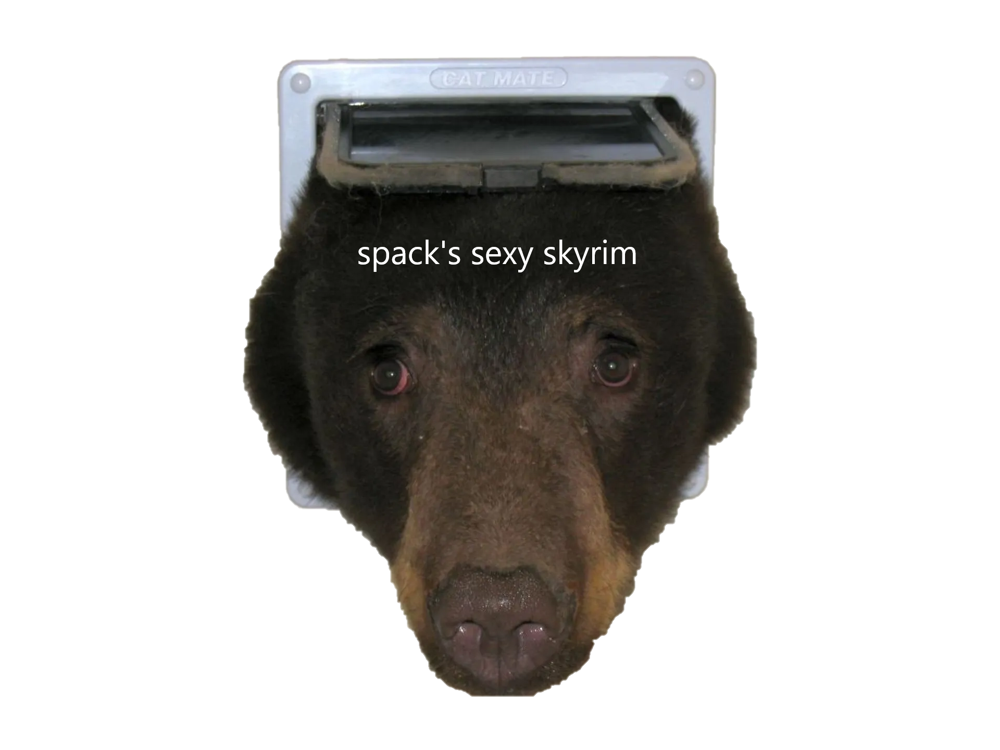
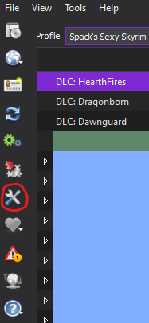
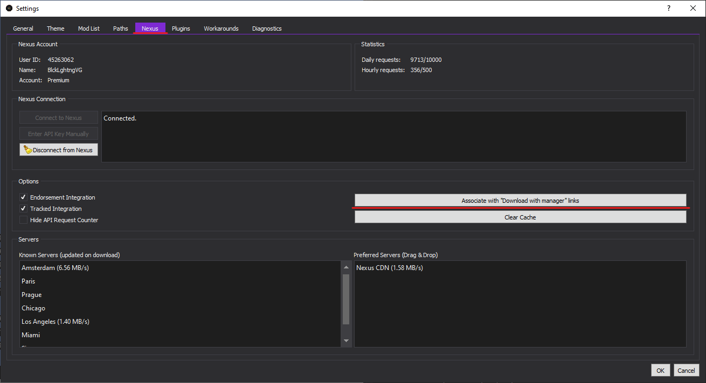
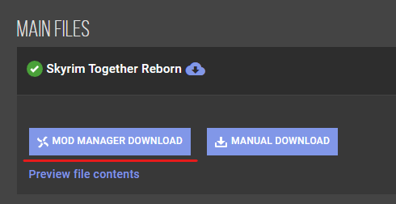
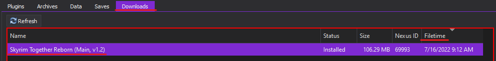
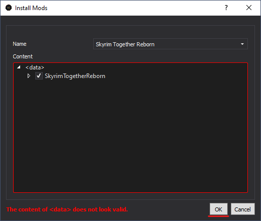
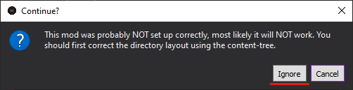
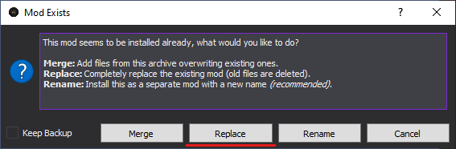

# SSS
A Skyrim Together Wabbajack Modlist

View the complete list of mods [here](https://loadorderlibrary.com/lists/spacks-sexy-skyrim).

## Contents
  - [Preamble](#preamble)
  - [Requirements](#requirements)
    - [Accounts](#accounts)
    - [Disk Space](#disk-space)
  - [Installation](#installation)
    - [Pre-Installation](#pre-installation)
    - [Wabbajack Installation](#wabbajack-installation)
      - [Installing Wabbajack](#installing-wabbajack)
      - [Downloading and Installing SSS](#downloading-and-installing-SSS)
      - [Problems with installation](#problems-with-installation)
  - [Post-Installation](#post-installation)
    - [Game Folder](#game-folder)
    - [Installing the ENB](#installing-the-enb)
  - [Playing the Modist](#playing-the-list)
    - [Starting up the List](#starting-up-the-list)
    - [Starting the Game](#starting-the-game)
    - [Important Mod-Added Controls](#important-mod-added-controls)
  - [Updating](#updating)
    - [Updating Skyrim Together](#updating-skyrim-together)
    - [Updating the Modlist](#updating-the-modlist)
  - [FAQ](#faq)
  - [Removing the Modlist](#removing-the-modlist)
  - [Credits and Thanks](#credits-and-thanks)

## Preamble
Spack's Sexy Skyrim (hereinafter referred to as SSS) is the modlist ever.

If you're new to installing a Wabbajack modlist or Skyrim modding in general:
	**Please, please, please read this guide in its entirety.**

## Requirements
### Accounts
##### NexusMods
  - You will need a free [NexusMods](https://users.nexusmods.com/register) account.
  - Nexus Premium (~$7) is highly recommended as well. Otherwise, you will have to manually click the download button on each mod.

##### LoversLab
  - You will also need a free [LoversLab](https://www.loverslab.com/register/) account.

*If you do not have an account with one or both of these sites, make them now by clicking the links above.*

### Disk Space
  - Space required: **approx. 160 GB** (including downloads)
  - I recommend having the downloads folder on an SSD, as it will drastically speed up the installation.

## Installation
If you are updating the modlist, skip to the [updating section](#updating).

### Pre-Installation
Prior to installing, complete the following steps.

1. Install [Visual C++ x64](https://aka.ms/vs/16/release/vc_redist.x64.exe) & [.Net Runtime v6 desktop x64](https://dotnet.microsoft.com/download/dotnet/6.0/runtime).
2. **Fully uninstall Skyrim** by deleting the Skyrim Special Edition folder in Steam and the Skyrim Special Edition folder inside `Documents\My Games`.
3. Reinstall Skyrim **outside of a Windows system-managed folder. (e.g. Desktop, Downloads)**. Somewhere like `C:\Games` is a good location. I recommend using [this program](https://github.com/LostDragonist/steam-library-setup-tool/wiki/Usage-Guide) to easily set up a new Steam library location.
4. Change Skyrim so it does not [automatically update](https://help.steampowered.com/en/faqs/view/71AB-698D-57EB-178C#disable).
5. Start the game once and let it do the graphics check. Do not worry about the settings as they will be replaced during installation.
6. Exit and proceed with installation once you've reached the main menu.

### Wabbajack Installation

#### Installing Wabbajack
Download the [latest version of Wabbajack](https://github.com/wabbajack-tools/wabbajack/releases) and place it in a folder such as `C:\Wabbajack`. **Do not install it into a Windows system-managed folder. (e.g. Desktop, Downloads)** I recommend placing it on an SSD as it will work quicker on there.

#### Downloading and Installing SSS
Downloading and installing the modlist can take a while depending on your internet speed and hardware. To install SSS, complete the following steps.

1. [Grab the latest version of the modlist from here.](/../../releases/latest) You only need to download the .wabbajack file. 
2. Open the downloaded file. Wabbajack should open.
3. Set the Installation Location to be somewhere like `C:\SSS`. **Do not install it into a Windows system-managed folder. (e.g. Desktop, Downloads)**
4. The Download Location will autofill, but you are free to set a custom location. (on another drive, for example)
5. Press the button to begin the install. Feel free to go do something else while WJ does its thing.
6. If the installation is successful, move on to [Post-Installation](#post-installation). If not...

##### Problems with Installation
It is possible that you may encounter an error with Wabbajack when installing. Some common issues are listed below.

- Could not download X file:
	- Big files can fail to download due to connection issues. You can either try running Wabbajack again or download the file manually and place it in the downloads folder.

- Wabbajack could not find my game folder:
	- Either buy the game or re-read the [Pre-Installation](#pre-installation) step.

- Antivirus reports a virus:
	- Windows may automatically quarantine a key file which is needed for Mod Organizer. You can fix this by [adding an exclusion for Mod Organizer in windows defender](https://www.thewindowsclub.com/exclude-a-folder-from-windows-security-scan).

## Post-Installation

### Game Folder
SSS uses a Wabbajack feature called Stock Game to keep your original Skyrim installation clean. All the files that you need to run the list are in a folder called “Game Root”.

### Installing the ENB
SSS is designed for use with Cabbage ENB. However, the author has not given permission for the files to be whitelisted for Wabbajack, so it has to be downloaded and installed manually, which is simple enough.

1. [Download the preset from here](https://drive.google.com/uc?export=download&id=1Df8QfYbIhiDj6k3dLwW5yEDgEva75T4y).
2. Open the archive and copy **ONLY** the `enbseries` folder.
3. Paste this folder into `SSS\Game Root`. Windows should ask you whether you want to replace or skip the file. **Press skip – do not overwrite!**

## Playing the List

### Starting up the List
Open the installation folder and double click on the program called `ModOrganizer.exe`. 

Make sure the dropdown box on the right is set to `Skyrim Together Reborn` and press the `Run` button. When prompted, select `SkyrimSE.exe` **from the modlist's "Game Root" folder – NOT Steam's Skyrim Special Edition folder!**

### Starting the Game
SSS uses [Optional Quick Start](https://www.nexusmods.com/skyrimspecialedition/mods/63953). You are free to either play through the introduction or skip it.

### Important Mod-Added Controls
- Skyrim Together Menu: Right Control
- Emotes Menu: Right Alt
- Lock-On: Middle Mouse Button
- Toggle UI: X
- Screenshot: F1 (screenshots are saved to the Game Root folder)
- ENB Menu: F11
- Toggle DOF: F10
- Health Potion Hotkey: <
- Stamina Potion Hotkey: >
- Magicka Potion Hotkey: /
- Simplest Horses Menu: H

Phew. You made it! ***Now go play your dang videogame.***

## Updating
There are two important updates you should be aware of:
- Updates to Skyrim Together. I recommend always having the latest version.
- Updates to the modlist itself. These are not required, but may have vital fixes; check the [changelog](CHANGELOG.md).

### Updating Skyrim Together
If there is an update to ST, it's very easy to apply yourself and is much less time-consuming to update than installing the latest list.

#### Enabling MO2 Downloads
If you've already done this once, you can skip to the [next section](#downloading-and-updating-skyrim-together).

1. In MO2, press Ctrl+S or press the Settings button in the top left.

2. In the Settings window, go to the "Nexus" tab and click `Associate with "Download with manager" links`.

#### Downloading and Updating Skyrim Together
1. Go to the [Skyrim Together NexusMods page](https://www.nexusmods.com/skyrimspecialedition/mods/69993?tab=files) and click the `Mod Manager Download` button under "Main Files".

2. The mod should now be downloading through MO2. You can find it under the "Downloads" tab in the right pane of MO2 by sorting by filetime. Once the download is finished, double click the file to install it.

3. A window will pop up. Press `OK`.

4. Another window will pop up. Press `Ignore`.

5. *Another* window will pop up. Press `Replace`.

6. You're done!

### Updating the Modlist
**Notes**:
- Any mods you have added yourself will be deleted when updating.
- Unless explicitly stated, updates to the modlist should be save-compatible.

Before updating, back up your saves (located in `SSS\profiles\Spack's Sexy Skyrim\saves`) to a separate folder.

Updating is like re-installing the list. Simply download the new .wabbajack file and open it. Make sure your paths are the same and tick the `overwrite existing modlist` button. Once the install is finished, you may copy your saves over.

## FAQ
#### I installed the ENB incorrectly, or I want better performance
- The tweaks I've made to Cabbage are contained within the `SSS\tools\ENB Organizer\Games\SkyrimSE\Presets` folder. Simply choose either the Default or Performance files, then copy the files within that folder to the Game Root folder, overwriting when prompted.

#### Should I choose the default ENB preset or the performance ENB preset?
- Try default first. If you get frequent dips below 30fps, I would switch to the performance preset.

#### When launching Skyrim Together, I get an error about "Address Library"
- You didn't select the correct SkyrimSE executable. When launching Skyrim Together through MO2, hold down Space and select the correct .exe from `SSS\Game Root`.

#### How do I enable donger
- Enable male and/or female nudity by expanding the `Nudity` separator in the left pane of MO2, and activating the respective mods.

#### I don't like the included ENB.
- The list uses NAT.ENB's weather, so you may easily replace Cabbage with an ENB preset that is made for its weathers, such as... [NAT.ENB](https://www.nexusmods.com/skyrimspecialedition/mods/27141). Another recommendation is [Berserkyr](https://www.nexusmods.com/skyrimspecialedition/mods/62381).

#### Various character overlays (e.g. bodypaints) do not sync
- As far as I know, this is currently an issue with Skyrim Together. Idk.

#### The game crashes on startup!
- Once the game window opens, don't tab out until you get to the main menu. It doesn't like that.

#### My character's hair/warpaint/skin/virginity/etc disappeared
- Save, quit to menu, and reload

## Removing the Modlist
Everything in the modlist is self-contained. Simply delete the modlist folder, and you have uninstalled it.

## Credits and Thanks
- _YOU_ for reading this.
- Althro and the Animonculory Team for AVO, the foundation of this modlist. Let's be real here: they did 99% of the work for me.
- The bear for
